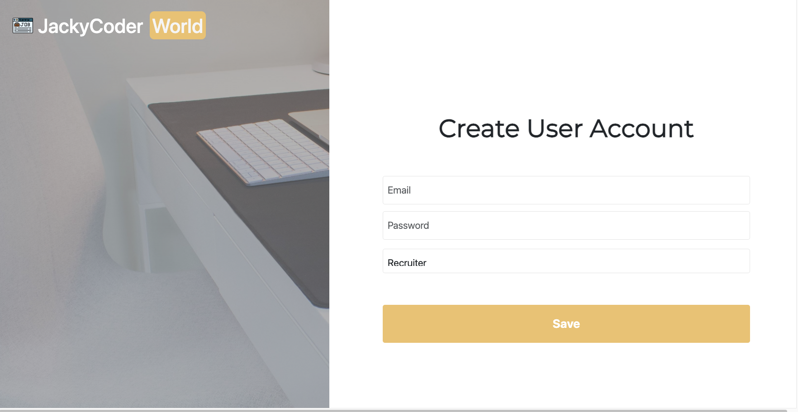
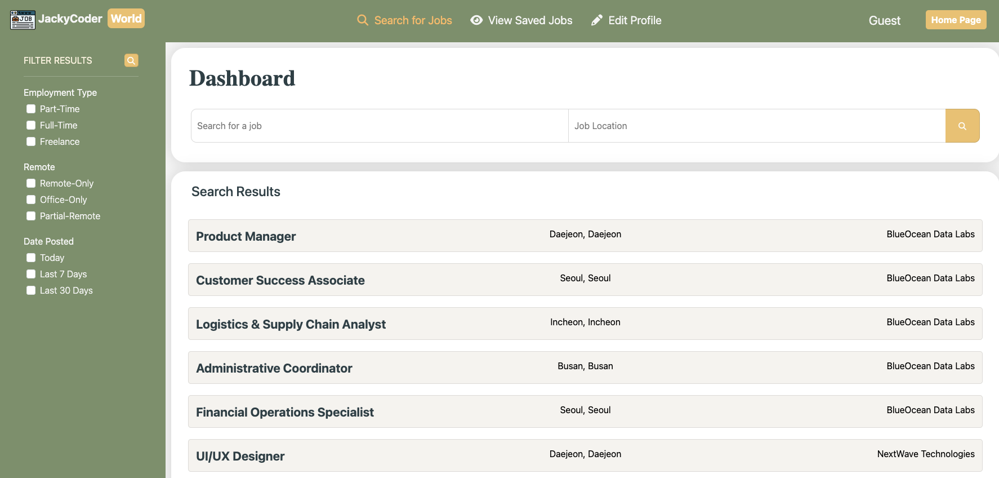
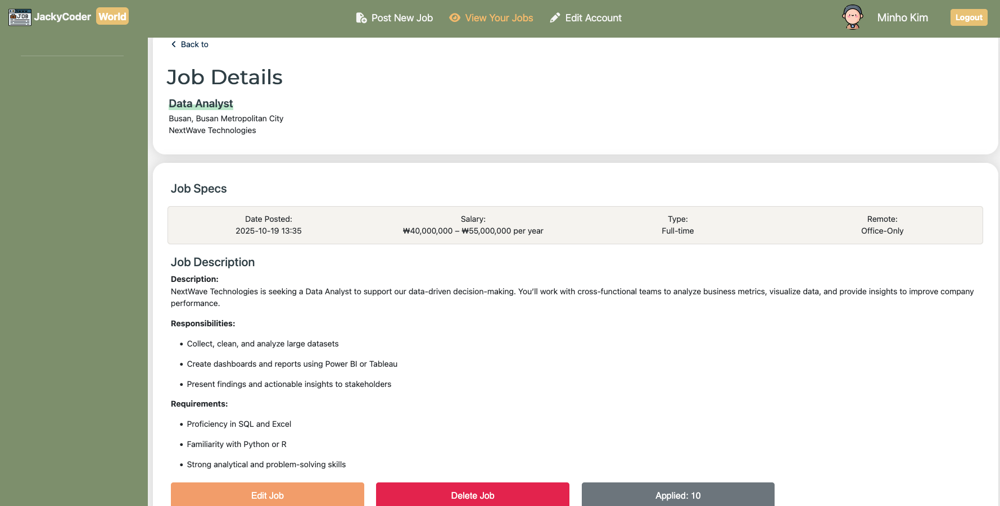

👔 求職平台網站
===

[前往網站](http://jackycoder.us-east-2.elasticbeanstalk.com/)
--

介紹
---
這是一個同時支援徵才方與求職者兩種角色的求職平台。徵才方可以發布職缺以尋找合適人選；求職者可以瀏覽職缺、收藏感興趣的職位並提交申請。雙方皆可建立與更新個人檔案。

要使用以上互動功能需先登入。未登入的訪客仍可瀏覽職缺，但無法收藏或投遞履歷。

技術堆疊
---
* 前端: `JavaScript` , `HTML` , `CSS` , `Thymeleaf` , `Summernote`
* 框架: `Bootstrap` , `Spring Boot3` , `Spring MVC` , `Spring Data JPA` , `Spring Security`
* 後端: `Java`
* 雲端與部屬: `AWS S3` , `AWS RDS` , `AWS Elastic Beanstalk` , `AWS Systems Manager Parameter Store`
* 資料庫: `MySQL` , `Hibernate ORM`
* 工具: `Maven` , `Git/GitHub` , `IntelliJ IDEA`

使用者介面
---
    帳號:recruiter1@gmail.com
    密碼:12345678 

    帳號:jobseeker1@gmail.com
    密碼:12345678

    帳號:jobseeker2@gmail.com
    密碼:12345678

    帳號:jobseeker3@gmail.com
    密碼:12345678
    
    備註:
    你可以註冊新帳號試用，或直接使用以上提供的帳號與密碼登入。
    
#### 首頁:

#### 登入頁面:

#### 註冊頁面:

#### 訪客視圖(首頁):

#### 求職者 - 首頁:

#### 求職者 - 個人檔案:

#### 求職者 - 已收藏職缺:

#### 求職者 - 職缺頁面:

#### 徵才方 - 首頁:

#### 徵才方 - 個人檔案:

#### 徵才方 - 新增職缺:

#### 徵才方 - 職缺詳情:

#### 徵才方 - 應徵者清單:

#### 徵才方 - 篩選應徵者結果:

