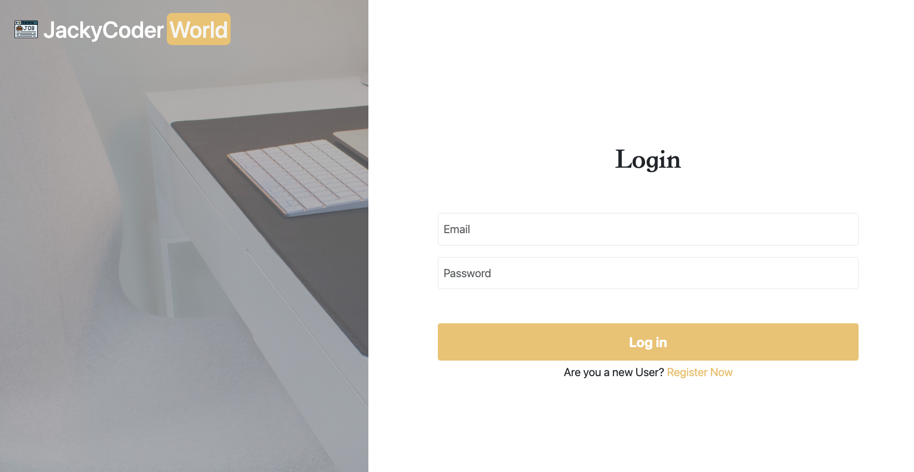
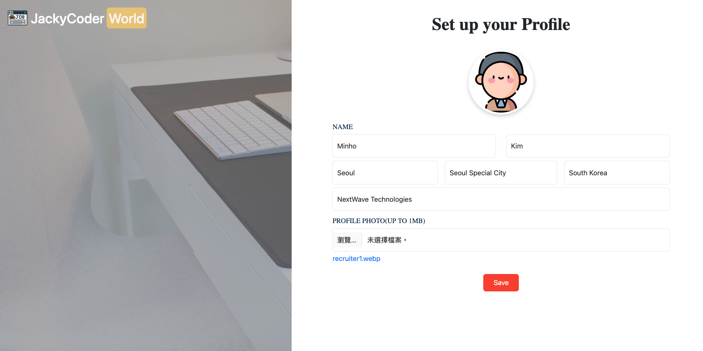

👔 Jobportal Website
===

[Go to Website](http://jackycoder.us-east-2.elasticbeanstalk.com/)
--

Introduce
---
This is a job platform with two user roles: recruiters and job seekers.Recruiters can post job openings to find the right candidates, while job seekers can browse listings, save their favorite positions, and submit applications. Both sides can create and update their personal profiles.

To access these interactive features, users must be signed in.
Visitors who aren’t logged in can still explore job listings, but they won’t be able to save or apply for positions.

Technology Stack
---
* Frontend: `JavaScript` , `HTML` , `CSS` , `Thymeleaf` , `Summernote`
* Frameworks: `Bootstrap` , `Spring Boot3` , `Spring MVC` , `Spring Data JPA` , `Spring Security`
* Backend: `Java`
* Cloud&Deployment: `AWS S3` , `AWS RDS` , `AWS Elastic Beanstalk` , `AWS Systems Manager Parameter Store`
* Database: `MySQL` , `Hibernate ORM`
* Tooling: `Maven` , `Git/GitHub` , `IntelliJ IDEA`

User Interface
---
    Account:recruiter1@gmail.com
    Password:12345678 

    Account:jobseeker1@gmail.com
    Password:12345678

    Account:jobseeker2@gmail.com
    Password:12345678

    Account:jobseeker3@gmail.com
    Password:12345678
    
    Note:
    You can register a new account to try it out, 
    or log in directly using the provided account and password.
    
#### Home Page:

#### Login Page:

#### Registraction Page:

#### Guest View(Home Page):

#### Jobseeker - Home Page:

#### Jobseeker - Profile:

#### Jobseeker - Saved Jobs:

#### Jobseeker - Jobs Page:

#### Recruiter - Home Page:

#### Recruiter - Profile:

#### Recruiter - Post a New Job:

#### Recruiter - Job Details:

#### Recruiter - Applicant List:

#### Recruiter - Filter Applicants:

