👔 구직·채용 웹사이트
===

[웹사이트 가기](http://jackycoder.us-east-2.elasticbeanstalk.com/)
--

소개
---
이 서비스는 채용담당자와 구직자 두 가지 사용자 역할을 지원하는 구직·채용 플랫폼입니다. 채용담당자는 채용 공고를 등록해 적합한 인재를 찾을 수 있고, 구직자는 공고를 탐색하고 관심 채용을 저장하거나 지원서를 제출할 수 있습니다. 두 사용자 모두 개인 프로필을 생성하고 수정할 수 있습니다.

이러한 상호작용 기능을 이용하려면 로그인이 필요합니다. 로그인하지 않은 방문자도 공고를 둘러볼 수는 있지만, 저장이나 지원 기능은 사용할 수 없습니다.

기술 스택
---
* 프론트엔드: `JavaScript` , `HTML` , `CSS` , `Thymeleaf` , `Summernote`
* 프레임워크: `Bootstrap` , `Spring Boot3` , `Spring MVC` , `Spring Data JPA` , `Spring Security`
* 백엔드: `Java`
* 클라우드/배포: `AWS S3` , `AWS RDS` , `AWS Elastic Beanstalk` , `AWS Systems Manager Parameter Store`
* 데이터베이스: `MySQL` , `Hibernate ORM`
* 도구: `Maven` , `Git/GitHub` , `IntelliJ IDEA`

사용자 인터페이스
---
    이매일:recruiter1@gmail.com
    비밀번호:12345678 

    이매일:jobseeker1@gmail.com
    비밀번호:12345678

    이매일:jobseeker2@gmail.com
    비밀번호:12345678

    이매일:jobseeker3@gmail.com
    비밀번호:12345678
    
    Note:
    You can register a new account to try it out, 
    or log in directly using the provided account and password.
    
#### Home Page:
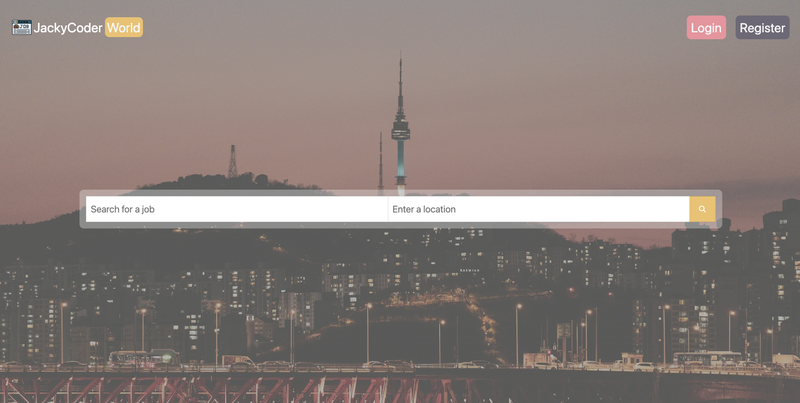

#### Login Page:
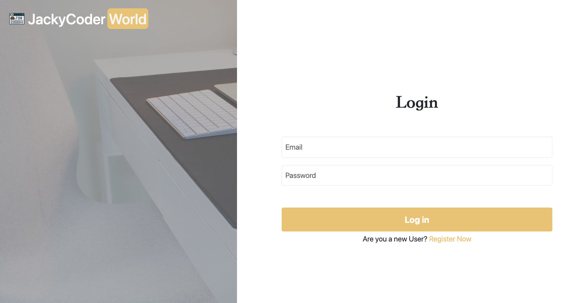

#### Registraction Page:
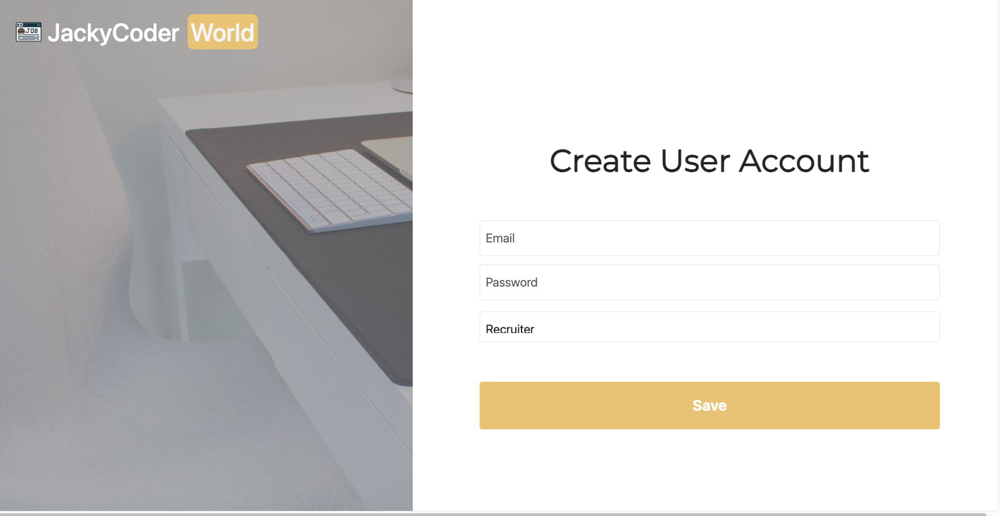

#### Guest View(Home Page):
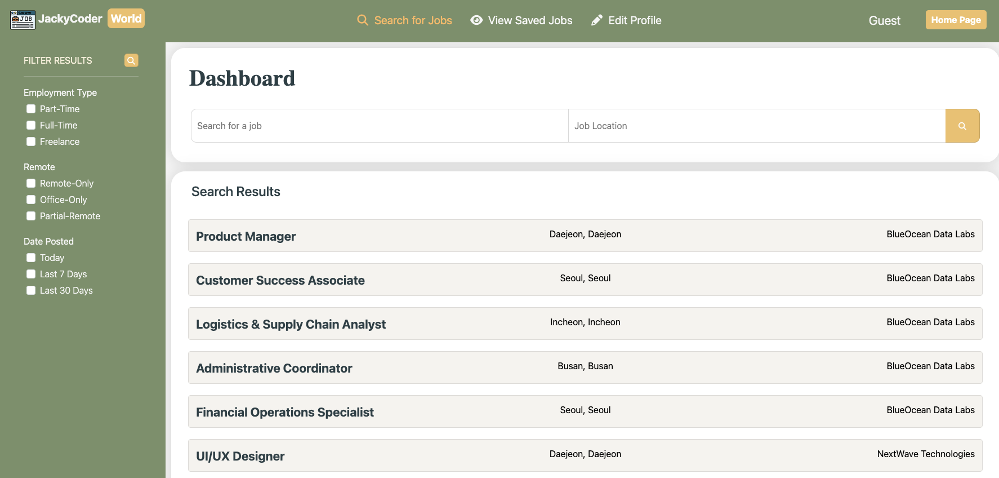

#### Jobseeker - Home Page:
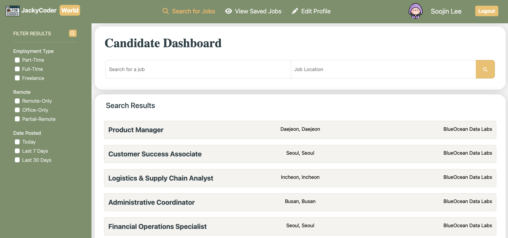

#### Jobseeker - Profile:
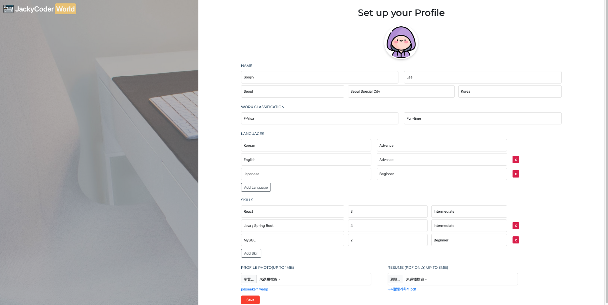

#### Jobseeker - Saved Jobs:
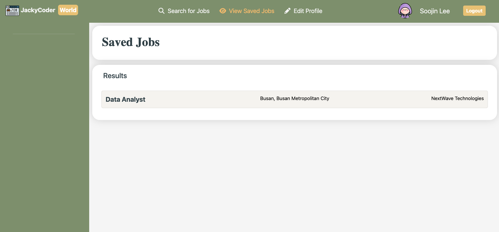

#### Jobseeker - Jobs Page:
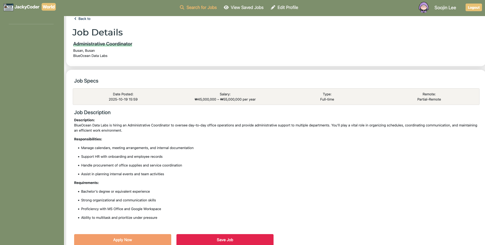

#### Recruiter - Home Page:
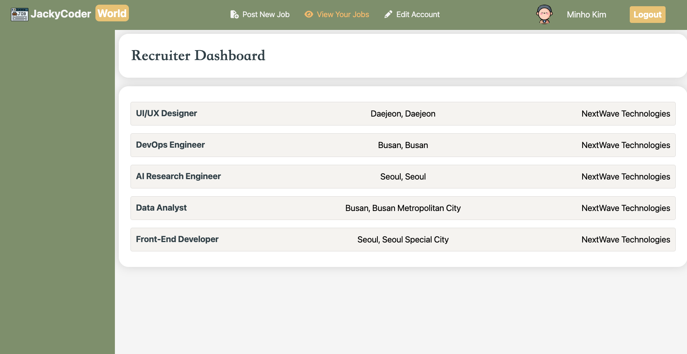

#### Recruiter - Profile:
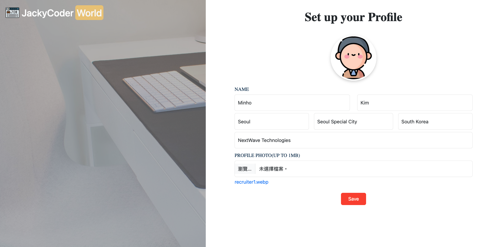

#### Recruiter - Post a New Job:
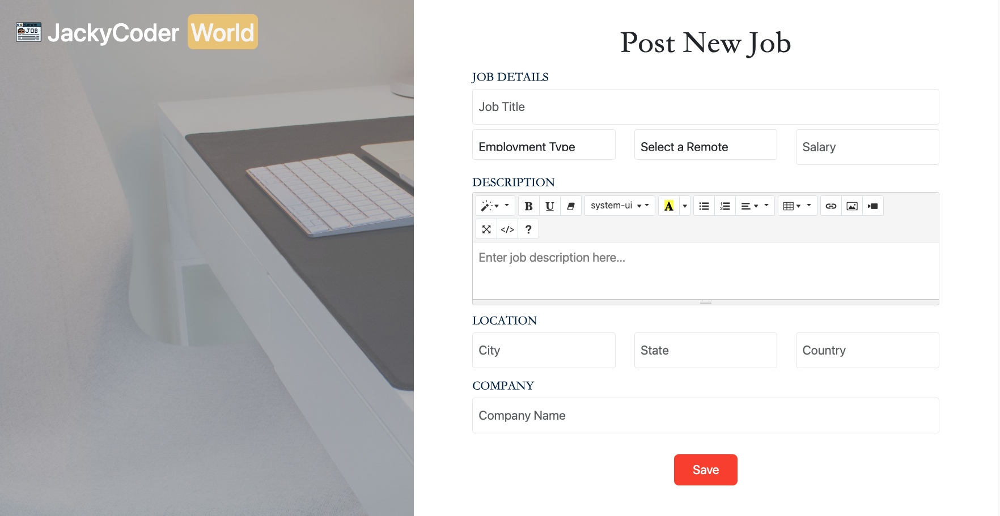

#### Recruiter - Job Details:
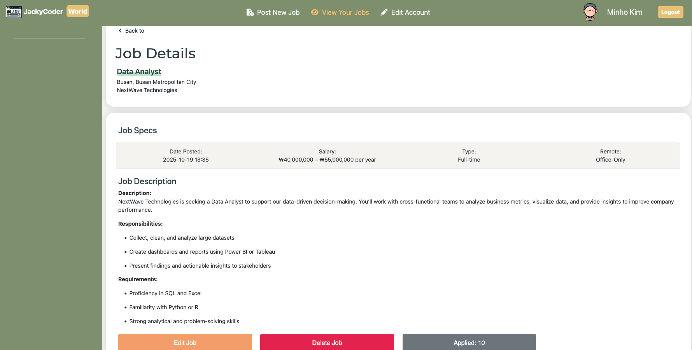

#### Recruiter - Applicant List:
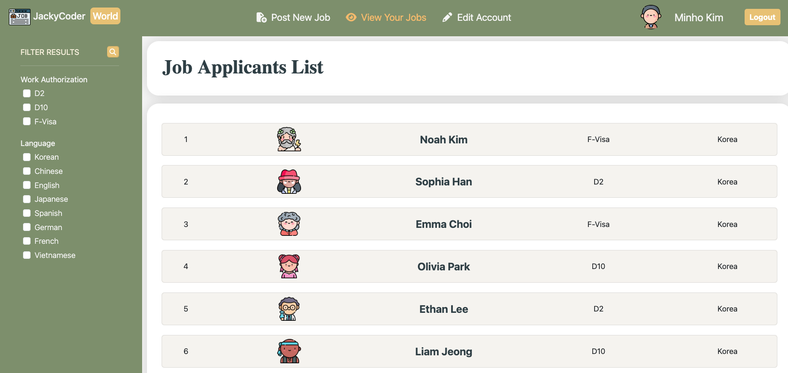

#### Recruiter - Filter Applicants:
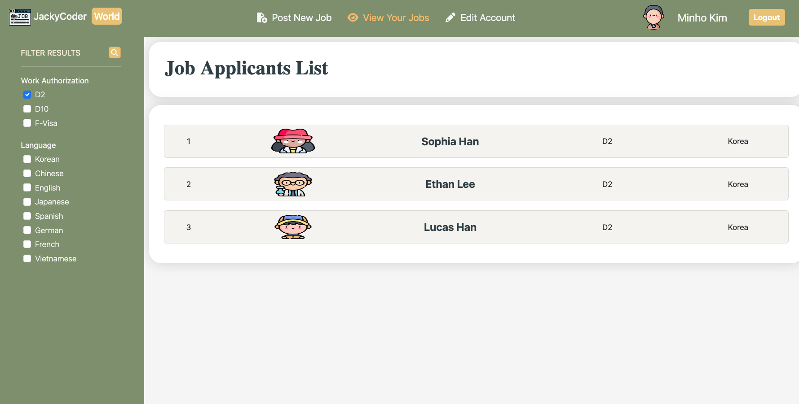

