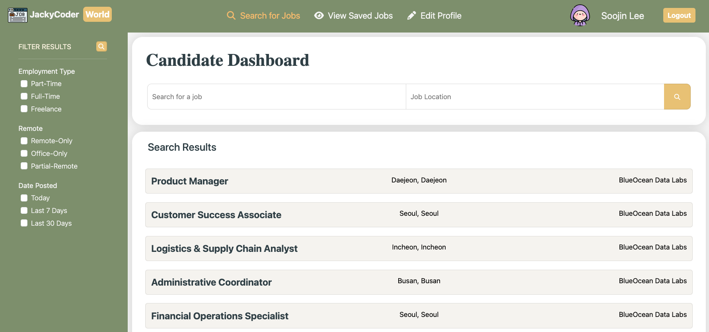

👔 Jobportal Website
===

[Go to Website](http://jackycoder.us-east-2.elasticbeanstalk.com/)
--

Introduce
---
This is a job platform with two user roles: recruiters and job seekers.Recruiters can post job openings to find the right candidates, while job seekers can browse listings, save their favorite positions, and submit applications. Both sides can create and update their personal profiles.

To access these interactive features, users must be signed in.
Visitors who aren’t logged in can still explore job listings, but they won’t be able to save or apply for positions.

Technology Stack
---
* Frontend: `JavaScript` , `HTML` , `CSS` , `Thymeleaf` , `Summernote`
* Frameworks: `Bootstrap` , `Spring Boot3` , `Spring MVC` , `Spring Data JPA` , `Spring Security`
* Backend: `Java`
* Cloud&Deployment: `AWS S3` , `AWS RDS` , `AWS Elastic Beanstalk` , `AWS Systems Manager Parameter Store`
* Database: `MySQL` , `Hibernate ORM`
* Tooling: `Maven` , `Git/GitHub` , `IntelliJ IDEA`

User Interface
---
    
#### Home Page:

#### Login:

#### Registraction:

#### Guest - Home Page:

#### Jobseeker - Home Page:

#### Jobseeker - Profile:

#### Jobseeker - The list of saved jobs:

#### Jobseeker - Apply jobs:

#### Recruiter - Home Page:

#### Recruiter - Profile:

#### Recruiter - Post New Jobs:

#### Recruiter - Job Details:

#### Recruiter - The list of job applicants:

#### Recruiter - Filter Results:

